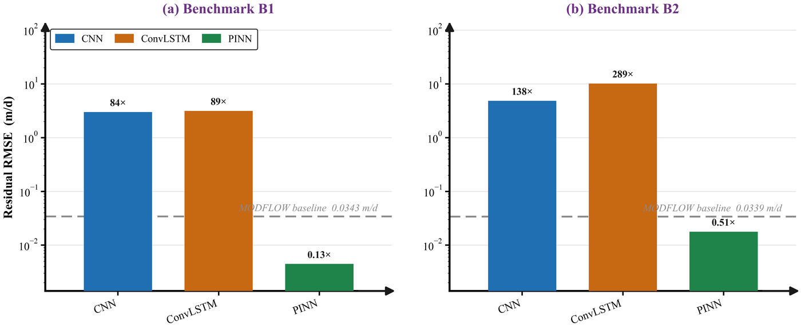
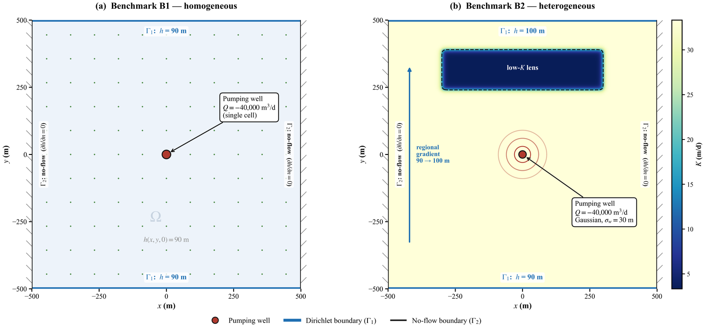
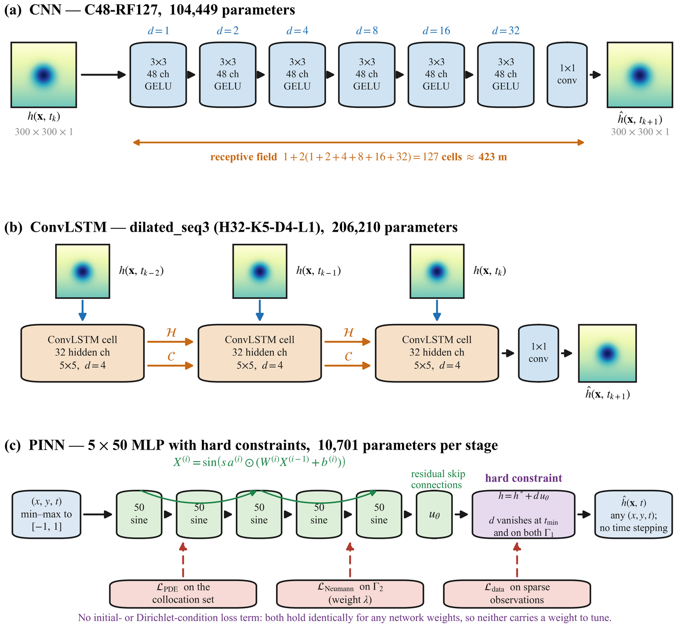

# Conservation Diagnostics for Deep Learning Groundwater Surrogates

Companion code for:

> **Beyond Accuracy: Conservation Diagnostics for Deep Learning Groundwater
> Surrogates.** Michael Edidem, Ruopu Li, Pouria Kharazi.
> *Computers and Geosciences.*

A deep-learning surrogate can reproduce hydraulic head to R² > 0.999 and still
violate the physics it was trained on. This repository implements a diagnostic
framework that evaluates predictive accuracy jointly with governing-equation
residuals, boundary-condition compliance, boundary-gradient direction and
mass-balance closure, and applies it to three surrogates on two benchmarks.

---

## The result in one table

Unconstrained arms over the test window t = 26-30 d, seed 42 for the data-driven
models and seed 200 for the physics-informed model. The CNN and ConvLSTM are
evaluated single-step; the physics-informed model is a direct spatiotemporal
query, so no stepping is involved. Head RMSE and the residual ratio are means
over the window, and mass error is the mean absolute residual over it as a
percentage of the imposed extraction. Every number is produced by the code in
this repository; see [Reproducing a number](#reproducing-a-number).

| Benchmark | Model | Head RMSE (m) | R² | PDE residual ratio | Mass error (% of well) |
|---|---|---:|---:|---:|---:|
| B1 | CNN | 0.0144 | 0.99985 | 84.0 | 37.8 |
| B1 | ConvLSTM | 0.0232 | 0.99960 | 88.6 | 289.6 |
| B1 | PINN | 0.0092 | 0.99994 | **0.13** | **0.42** |
| B2 | CNN | 0.0366 | 0.99989 | 137.9 | 62.4 |
| B2 | ConvLSTM | 0.0652 | 0.99964 | 289.1 | 114.0 |
| B2 | PINN | 0.0147 | 0.99998 | **0.51** | **1.5** |

The residual ratio is the model's governing-equation residual divided by
MODFLOW's own residual under the same discrete operator, so a value of 1 means
the surrogate is as consistent as the solver that generated its training data.
All six models pass any conventional accuracy screen. Three of them carry
residuals two orders of magnitude above the numerical baseline and fail to close
mass balance.



---

## The two benchmarks



Both are transient, unconfined, single-layer aquifers on a 1000 × 1000 m domain
discretised at 300 × 300, simulated in MODFLOW-2005 over 0–30 days with 33
saved snapshots. Dirichlet conditions apply on the north and south edges,
no-flow east and west.

| | B1 | B2 |
|---|---|---|
| Hydraulic conductivity | 33.33 m/d, uniform | 33.33 m/d with a 10:1 low-K lens |
| Specific yield | 0.10 | 0.10 |
| Boundary head, south / north | 90 m / 90 m | 90 m / 100 m |
| Initial head | 90 m, uniform | Dupuit profile for the regional gradient |
| Well | Gaussian, σ = 30 m, centred | Gaussian, σ = 30 m, centred |
| Pumping rate | −40,000 m³/d | −40,000 m³/d |

The B2 lens sits between the well and the upgradient boundary, so it throttles
the well's principal supply. Because K varies in space, the Boussinesq operator
gains a term `h (∇K · ∇h)`; `problem.py` returns K together with its analytic
gradient for that reason.

Generate them with `benchmarks/b1/gen_b1.py` and `benchmarks/b2/gen_b2.py`,
which require `flopy` and a MODFLOW-2005 executable.

---

## The three surrogates



| Model | Configuration | Prediction mode |
|---|---|---|
| CNN | six dilated 3×3 convolutions, 48 channels, dilations 1–32, GELU, receptive field 127 cells (~423 m), 104,449 parameters | single-step and autoregressive rollout |
| ConvLSTM | dilated, sequence length 3, 32 hidden channels, 5×5 kernel, dilation 4, one layer, receptive field 23–55 cells | single-step and autoregressive rollout |
| PINN | 5 hidden layers × 50 neurons, sine activation with a learnable per-layer scale, residual skip connections, two-stage Adam → L-BFGS | direct spatiotemporal query |

The physics-informed model has no single-step/rollout distinction: it is queried
at (x, y, t) directly, so there is nothing to roll out.

Its Dirichlet and initial conditions hold identically by construction, through a
multiplicative trial function

```
d = ((t - t_min)(y_max - y)(y - y_min)) / ((t_max - t_min)(y_max - y_min)²)
h = h* + d · u
```

where `d` vanishes at `t = t_min` and at both y boundaries whatever the network
outputs. `src/constrained.py` applies the gridded analogue of the same idea to
the CNN and ConvLSTM, so that boundary enforcement can be tested independently
of the PDE residual term.

---

## The diagnostics

`src/diagnostics/groundwater_diagnostics.py` computes, per snapshot and pooled:

| Diagnostic | Meaning |
|---|---|
| Accuracy | MSE, MAE, RMSE, relative RMSE, R², all in metres |
| PDE residual | pointwise Boussinesq violation, and its ratio to MODFLOW's residual under the same stencil |
| Boundary error ε_BE | head discrepancy at the common boundary-evaluation rows |
| Boundary gradient | sign agreement with the reference at each Dirichlet boundary |
| Mass balance | storage change against boundary and well fluxes, as a percentage of the imposed extraction |
| Zone analysis | the same quantities split into well-influence, lens and background zones |
| Grid sensitivity | every residual re-evaluated on coarser stencils |

Predictions must be supplied as **absolute head in metres**; normalisation is
reversed before the diagnostics run, and normalised model losses are never
accepted as diagnostic input. Units are carried in the column names: accuracy in
metres, residuals in `_m_per_d`, fluxes and storage in `_m3_per_d`.

Each benchmark carries its own configuration, and both evaluators reject
reference data that does not match:

```bash
python src/diagnostics/evaluate_b2.py \
    --prediction-dir  "$GW_DATA/predictions/…/test_predictions" \
    --output-dir      out/b2_cnn \
    --model-name      "CNN B2 unconstrained" \
    --prediction-mode one-step
```

---

## Repository layout

```
src/
  pinn/b1/, pinn/b2/     two-stage physics-informed trainer, one tree per
                         benchmark; problem.py is the only file that differs
  cnn/                   dilated CNN surrogate
  convlstm/              temporal-residual ConvLSTM surrogate
  diagnostics/           the diagnostic package and the two evaluators
  constrained.py         hard Dirichlet enforcement for the gridded models
  paths.py               data-root resolution, used everywhere

benchmarks/b1/, b2/      MODFLOW generators
experiments/             noise sweep, collocation and supervision sweeps,
                         receptive-field ablation, architecture study
tests/                   diagnostics self-checks
docs/                    figures used by this README
```

B1 and B2 keep separate PINN trees deliberately. They differ only in
`problem.py`, but each writes its own `checkpoints/`, so the two cannot collide
and neither can silently inherit the other's configuration.

---

## Installation

```bash
git clone https://github.com/mikedidem/gw_surrogate_evaluation.git
cd gw_surrogate_evaluation
pip install -r requirements.txt
```

Training was run on Python 3.13 with PyTorch 2.11.0+cu128, CUDA 12.8 and NumPy
2.1.3, on a single Tesla T4. Regenerating the benchmarks additionally needs
`flopy` and a MODFLOW-2005 executable on `PATH`, or `MF2005_EXE` naming it.

---

## Data availability

This repository holds **code only**. The MODFLOW models, exported head
snapshots, trained checkpoints and diagnostic exports run to several gigabytes
and are distributed through the Open Science Framework project accompanying the
paper.

Point `GW_DATA` at that tree:

```bash
export GW_DATA=/path/to/gw_surrogate_data      # Linux, macOS
set     GW_DATA=D:\gw_surrogate_data           # Windows
```

If `GW_DATA` is unset, `./data` is used, so a copy or symlink placed there needs
no configuration. The expected layout is:

```
benchmarks/b1/, benchmarks/b2/   MODFLOW models and t*.txt snapshots
diagnostic_results/              one directory per evaluated arm
predictions/                     surrogate head fields, absolute metres
```

`src/paths.py` is the single place any of this is resolved.

---

## Reproducing a number

The MODFLOW self-check is the cheapest end-to-end test: evaluating the
reference data against itself must give zero head error and a residual ratio of
exactly one.

```bash
export GW_DATA=/path/to/gw_surrogate_data
python -m pytest tests/ -q
```

The tests skip cleanly when the data tree is absent.

To reproduce a table entry, run the evaluator on that arm's predictions and read
the field from `summary.json`. For the B2 CNN row above:

```bash
python src/diagnostics/evaluate_b2.py \
    --prediction-dir  "$GW_DATA/predictions/gw_mod/cnn_receptive_field_ablation/outputs/b2/rf127_c48_d1-2-4-8-16-32/unconstrained/seed42/test_predictions" \
    --output-dir      out/b2_cnn \
    --model-name      "CNN B2 unconstrained" \
    --prediction-mode one-step
```

```
summary.accuracy.mean_rmse_m                      0.0366
summary.accuracy.mean_r2                          0.999888
summary.pde_residual.model_to_modflow_rmse_ratio  137.888
summary.mass_balance.mean_abs_percent_of_well     62.41
```

Every figure in the paper is drawn from these exports, and each drawn value is
checked against the statistic its export recorded before it is plotted, so a
figure cannot drift from the table beside it.

---

## Citation

See [`CITATION.cff`](CITATION.cff). Please cite the paper rather than this
repository alone.

## License

Released under the MIT License; see [`LICENSE`](LICENSE).
